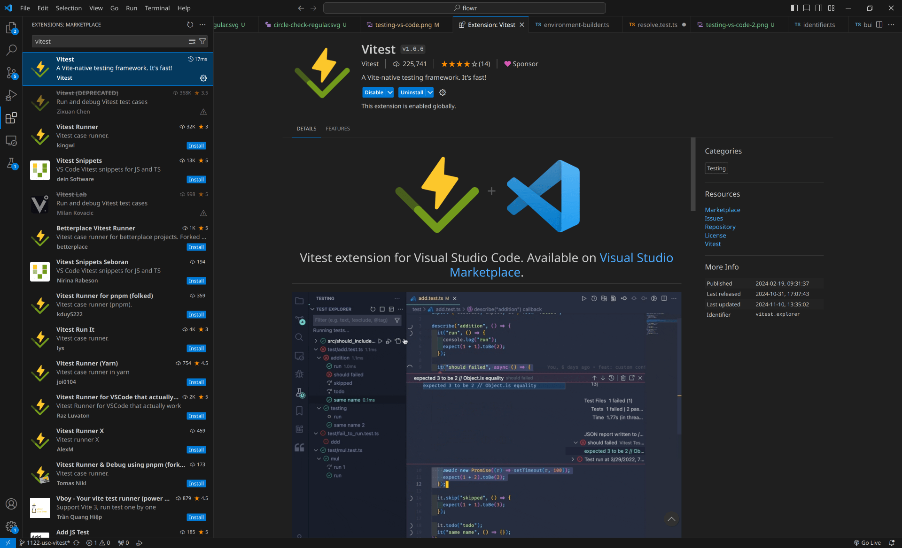
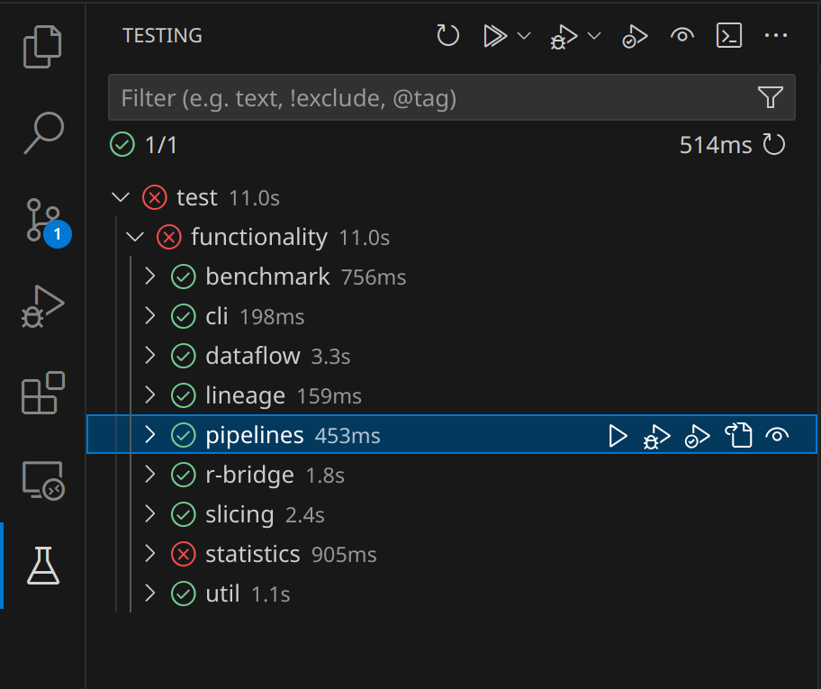
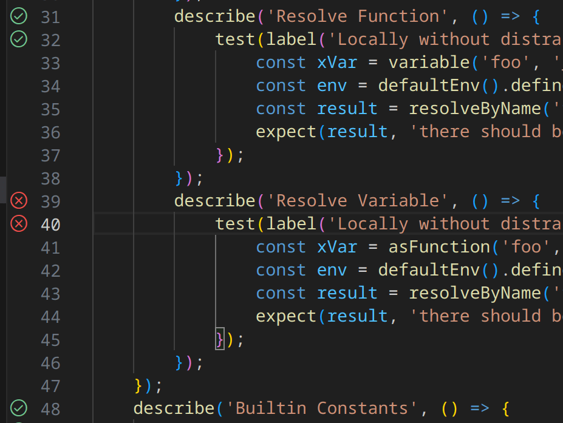

For the latest code-coverage information, see [codecov.io](https://app.codecov.io/gh/flowr-analysis/flowr), 
for the latest benchmark results, see the [benchmark results](https://flowr-analysis.github.io/flowr/wiki/stats/benchmark) wiki page.

- [Testing Suites](#testing-suites)
  - [Functionality Tests](#functionality-tests)
    - [Test Structure](#test-structure)
    - [Writing a Test](#writing-a-test)
    - [Running Only Some Tests](#running-only-some-tests)
  - [Performance Tests](#performance-tests)
  - [Oh no, the tests are slow](#oh-no-the-tests-are-slow)
  - [Testing Within Your IDE](#testing-within-your-ide)
    - [Using Visual Studio Code](#using-visual-studio-code)
    - [Using WebStorm](#using-webstorm)
- [CI Pipeline](#ci-pipeline)
- [Linting](#linting)
  - [Oh no, the linter fails](#oh-no-the-linter-fails)
  - [License Checker](#license-checker)

## Testing Suites

Currently, flowR contains two testing suites: one for [functionality](#functionality-tests) and one for [performance](#performance-tests). We explain each of them in the following.
A more general test experience is granted by `npm run checkup` which will include the construction of the docker image, the generation of the wiki pages, and the linter.

### Functionality Tests

The functionality tests represent conventional unit (and depending on your terminology component/api) tests.
We use [vitest](https://vitest.dev/) as our testing framework.
You can run the tests by issuing:

```shell
npm run test
```

Within the commandline,
this should automatically drop you into a watch mode which will automatically re-run the tests if you change the code.
If, at any time there are too many errors, you can use `--bail=<value>` to stop the tests after a certain number of errors.
For example:

```shell  
npm run test -- --bail=1
```

If you want to run the tests without the watch mode, you can use:

```shell
npm run test -- --no-watch
```

To run all tests, including a coverage report and label summary, run: 

```shell
npm run test-full
```

However, depending on your local R version, your network connection and potentially other factors, some tests may be skipped automatically as they don’t apply to your current system setup 
(or can't be tested with the current prerequisites). 
Each test can specify such requirements as part of the `TestConfiguration`, which is then used in the `test.skipIf` function of _vitest_.
It is up to the [ci](#ci-pipeline) to run the tests on different systems to ensure that those tests are ensured to run.

#### Test Structure

All functionality tests are to be located under [test/functionality](https://github.com/flowr-analysis/flowr/tree/main/test/functionality).

This folder contains three special and important elements:

- `test-setup` which is the entry point if *all* tests are run. It should automatically disable logging statements and configure global variables (e.g., if installation tests should run).
- `_helper` which contains helper functions to be used by other tests.
- `test-summary` which may produce a summary of the covered capabilities.

We name all tests using the `.test.ts` suffix and try to run them in parallel. 
Whenever this is not possible (e.g., when using `withShell`), please use `describe.sequential` to disable parallel execution for the respective test.

#### Writing a Test

Currently, this is heavily dependent on what you want to test (normalization, dataflow, quad-export, ...) 
and it is probably best to have a look at existing tests in that area to get an idea of what comfort functionality is available.

#### Running Only Some Tests

To run only some tests, vitest allows you to [filter](https://vitest.dev/guide/filtering.html) tests. 
Besides, you can use the watch mode (with `npm run test`) to only run tests that are affected by your changes.

### Performance Tests

The performance test suite of *flowR* uses several suites to check for variations in the required times for certain steps.
Although we measure wall time in the CI (which is subject to rather large variations), it should give a rough idea of the performance of *flowR*.
Furthermore, the respective scripts can be used locally as well.
To run them, issue:

```shell
npm run performance-test
```

See [test/performance](https://github.com/flowr-analysis/flowr/tree/main/test/performance) for more information on the suites, how to run them, and their results. If you are interested in the results of the benchmarks, see [here](https://flowr-analysis.github.io/flowr/wiki/stats/benchmark).


### Testing Within Your IDE
#### VS Code
With the vitest extension you can start tests driectly from the definition and explore your suite in the Testing tab. To get started simply install the [vitest Extension](https://marketplace.visualstudio.com/items?itemName=vitest.explorer).



| Testing Tab | In Code |
|-------------|---------|
|||

- Left-clicking the  or  Icon next to the code will rerun the test. Right-clicking will open a context menu, allowing you to debug the test.
- In the Testing tab you can run (and debug) all tests, individual suites or individual tests.

#### Webstorm 
Please follow the official guide [here](https://www.jetbrains.com/help/webstorm/vitest.html).


## CI Pipeline

We have several workflows defined in [.github/workflows](../.github/workflows/).
We explain the most important workflows in the following:

- [qa.yaml](../.github/workflows/qa.yaml) is the main workflow that will run different steps depending on several factors. It is responsible for:
  - running the [functionality](#functionality-tests) and [performance tests](#performance-tests)
    - uploading the results to the [benchmark page](https://flowr-analysis.github.io/flowr/wiki/stats/benchmark) for releases
    - running the [functionality tests](#functionality-tests) on different operating systems (Windows, macOS, Linux) and with different versions of R
    - reporting code coverage
  - running the [linter](#linting) and reporting its results
  - deploying the documentation to [GitHub Pages](https://flowr-analysis.github.io/flowr/doc/)
- [release.yaml](../.github/workflows/release.yaml) is responsible for creating a new release, only to be run by repository owners. Furthermore, it adds the new docker image to [docker hub](https://hub.docker.com/r/eagleoutice/flowr).
- [broken-links-and-wiki.yaml](../.github/workflows/broken-links-and-wiki.yaml) repeatedly tests that all links are not dead!

## Linting

There are two linting scripts.
The main one:

```shell
npm run lint
```

And a weaker version of the first (allowing for *todo* comments) which is run automatically in the [pre-push githook](../.githooks/pre-push) as explained in the [CONTRIBUTING.md](../.github/CONTRIBUTING.md):

```shell
npm run lint-local
```

Besides checking coding style (as defined in the [package.json](../package.json)), the *full* linter runs the [license checker](#license-checker).

In case you are unaware,
eslint can automatically fix several linting problems[](https://eslint.org/docs/latest/use/command-line-interface#fix-problems).
So you may be fine by just running:

```shell
npm run lint-local -- --fix
```

### Oh no, the linter fails

By now, the rules should be rather stable and so, if the linter fails,
it is usually best if you (if necessary) read the respective description and fix the respective problem.
Rules in this project cover general JavaScript issues [using regular ESLint](https://eslint.org/docs/latest/rules), TypeScript-specific issues [using typescript-eslint](https://typescript-eslint.io/rules/), and code formatting [with ESLint Stylistic](https://eslint.style/packages/default#rules).

However, in case you think that the linter is wrong, please do not hesitate to open a [new issue](https://github.com/flowr-analysis/flowr/issues/new/choose).

### License Checker

*flowR* is licensed under the [GPLv3 License](https://github.com/flowr-analysis/flowr/blob/main/LICENSE) requiring us to only rely on [compatible licenses](https://www.gnu.org/licenses/license-list.en.html). For now, this list is hardcoded as part of the npm [`license-compat`](../package.json) script so it can very well be that a new dependency you add causes the checker to fail &mdash; *even though it is compatible*. In that case, please either open a [new issue](https://github.com/flowr-analysis/flowr/issues/new/choose) or directly add the license to the list (including a reference to why it is compatible).
